# ME2401-USBJTAG
[English README is here.](./README-en.md)

FT2232H搭載USBシリアル変換モジュール

<div align="center">
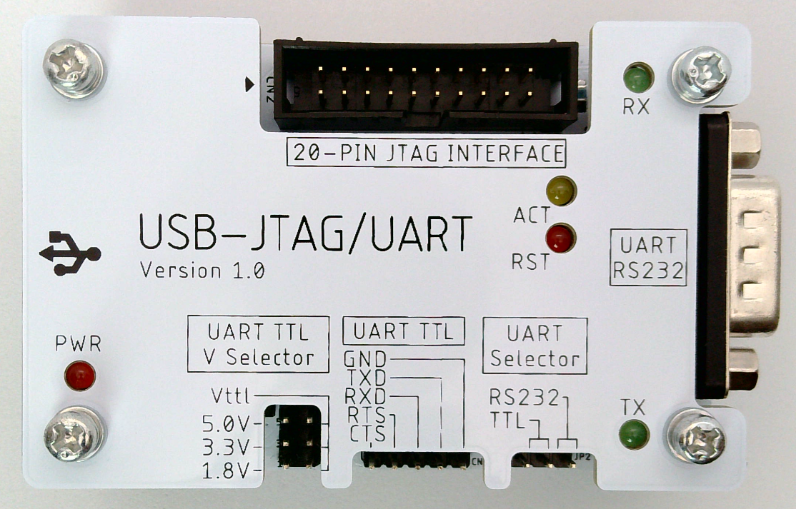
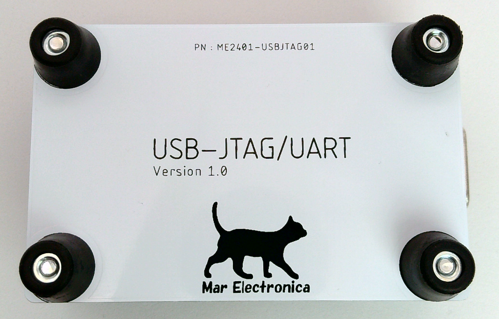
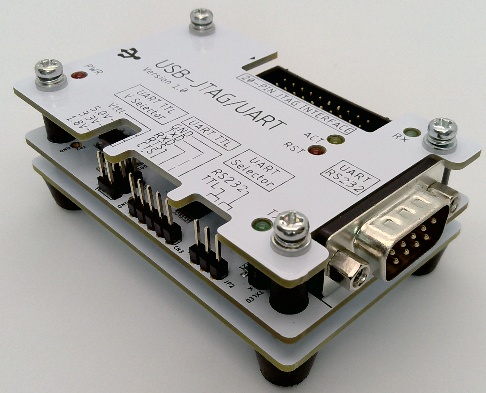
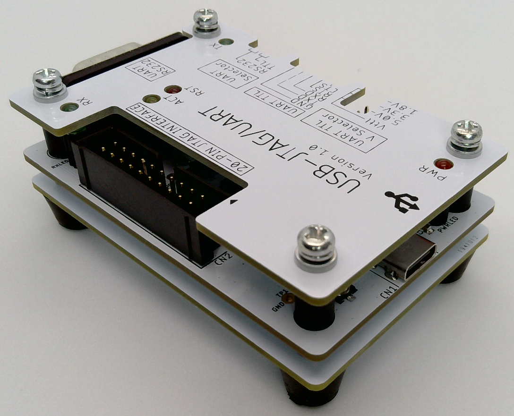
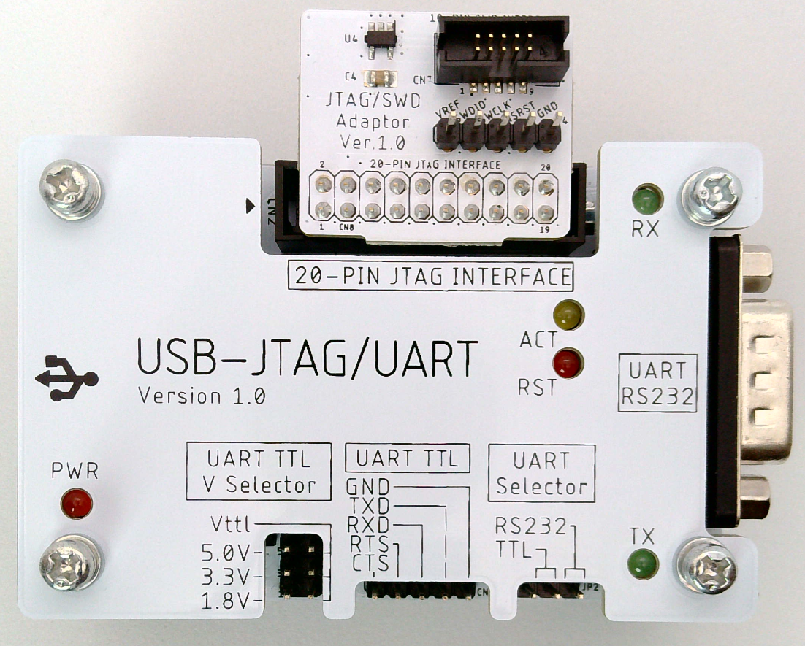
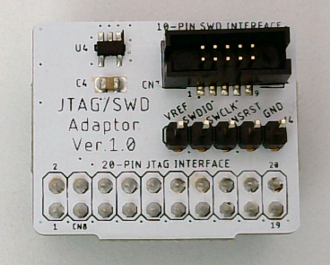
</div>


# 概要
<div align="center">
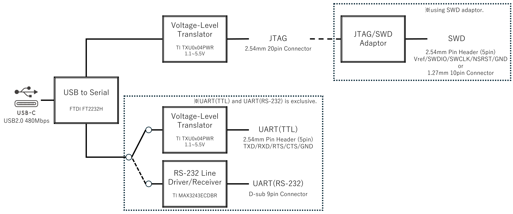
</div>

- FTDI製[FT2232H](https://ftdichip.com/products/ft2232hl/)搭載USBシリアル変換モジュール
- JTAGとUARTが同時に使用可能
- JTAGのVrefは1.1-5.5Vをサポート
- SWDアダプタ付属
- [OpenOCD](https://openocd.org/)を使用してJTAGデバッガとして使用可能
- UARTのロジックレベルはTTL(1.1-5.5V)とRS-232をサポート

# 仕様
- USB
  - USB2.0 High Speed 480Mbps
  - バスパワー動作
  - Type-Cコネクタ
- JTAG
  - 2.54mm 20pinコネクタ(CN2)
    - 20-pin [ARM Standard JTAG](https://developer.arm.com/documentation/101416/0100/Hardware-Description/Target-Interfaces/ARM-Standard-JTAG)互換
  - Vref電圧
    - 1.1V-5.5Vの範囲でリファレンス電圧を外部から供給可能
- SWD
  - SWDアダプタを使用してSWDでの接続が可能
  - 3ステートバッファによるSWDIOの双方向制御
  - 1.27mm 10pinコネクタ
    - [Cortex Debug (10-pin)](https://developer.arm.com/documentation/101416/0100/Hardware-Description/Target-Interfaces/Cortex-Debug--10-pin-)互換
  - 2.54mmピンヘッダ
    - SWDIO/SWCLK/nSRSTをサポート
  - Vref電圧
    - 1.1V-5.5Vの範囲でリファレンス電圧を外部から供給可能
- UART
  - ロジックレベルはTTL(1.1-5.5V)とRS-232を排他利用可能
    - ボード上のピンヘッダ(JP2)で選択
  - TTL
    - 2.54mmピンヘッダ(CN3)
      - TXD/RXD/RTS/CTSをサポート
    - 電圧
      - 1.8V/3.3V/5Vの電圧をボード上で供給可能
      - 1.1-5.5Vの範囲で電圧を外部から供給可能
	  - ボード上のピンヘッダで選択(JP1)
  - RS-232
    - D-Sub 9pinコネクタ(CN1)
    - RS-232のラインドライバ・レシーバ搭載
- 概寸
  - W83mm x D50mm x H35mm
  - W83mm x D64mm x H39mm (SWDアダプタ取付時)

<div align="center">
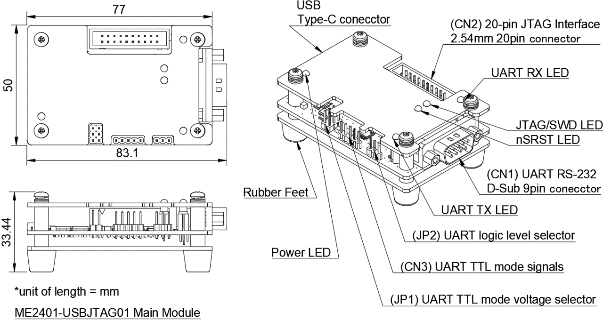
<BR><BR><BR><BR>
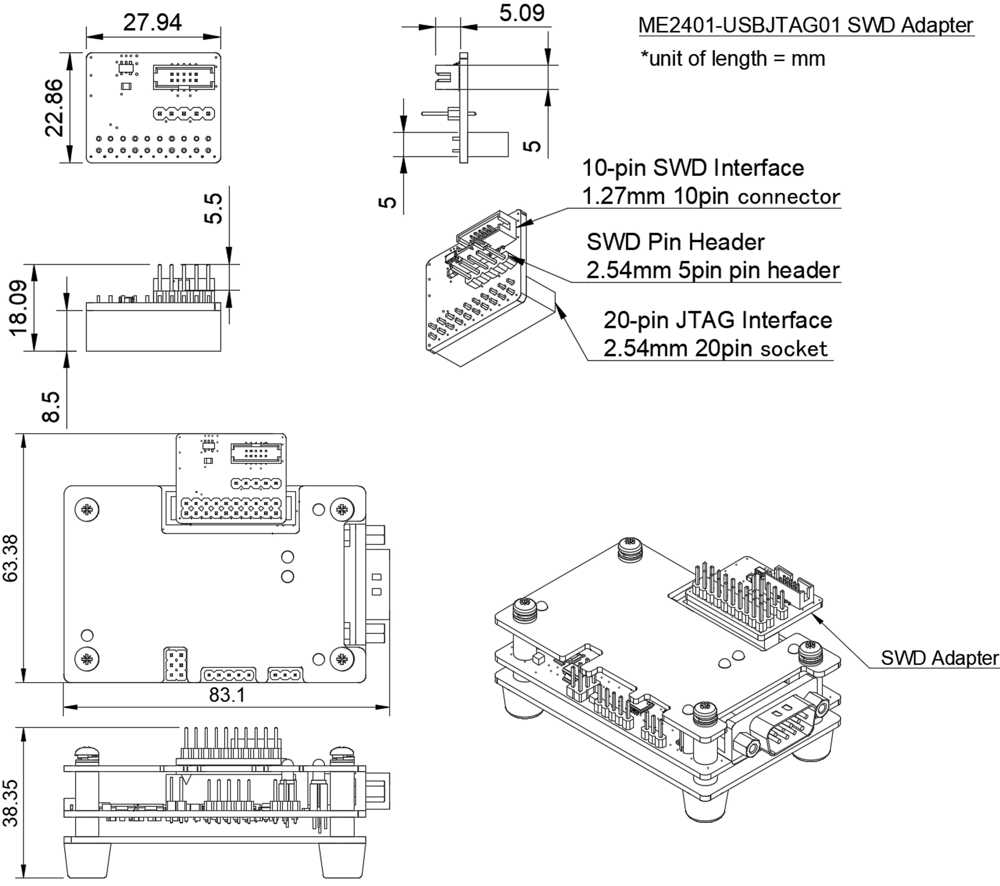
</div>

# 製品構成
## 同梱品
<div align="center">

| #  | 名称                      | 個数 |
|----|---------------------------|------|
| 1  | メイン基板                | 1    |
| 2  | 上面カバー                | 1    |
| 3  | 底面カバー                | 1    |
| 4  | SWDアダプタ               | 1    |
| 5  | 樹脂スペーサー(M3*5mm)    | 4    |
| 6  | 樹脂スペーサー(M3*10mm)   | 4    |
| 7  | ワッシャ付きネジ(M3*30mm) | 4    |
| 8  | ナット(M3)                | 4    |
| 9  | ゴム足                    | 4    |
| 10 | ジャンパソケット          | 2    |

</div>

## パッケージ
### パッケージ外観
- W160mm x D120mm x H20mm 段ボール箱
<div align="center">
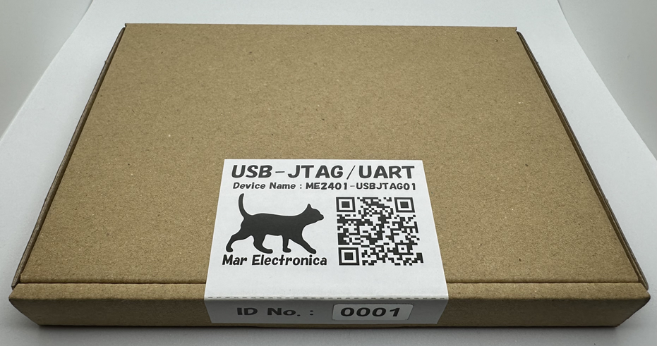
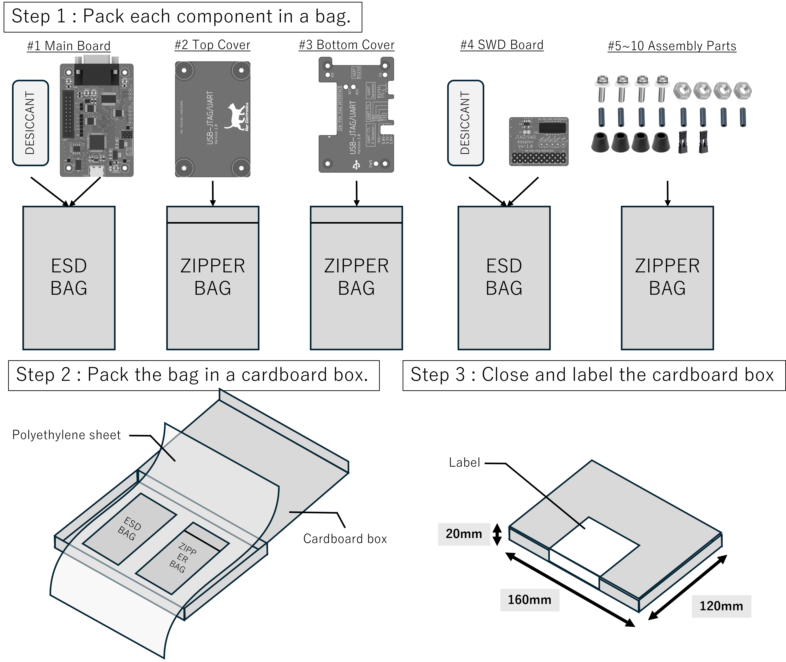
</div>

### パッケージ詳細
<div align="center">
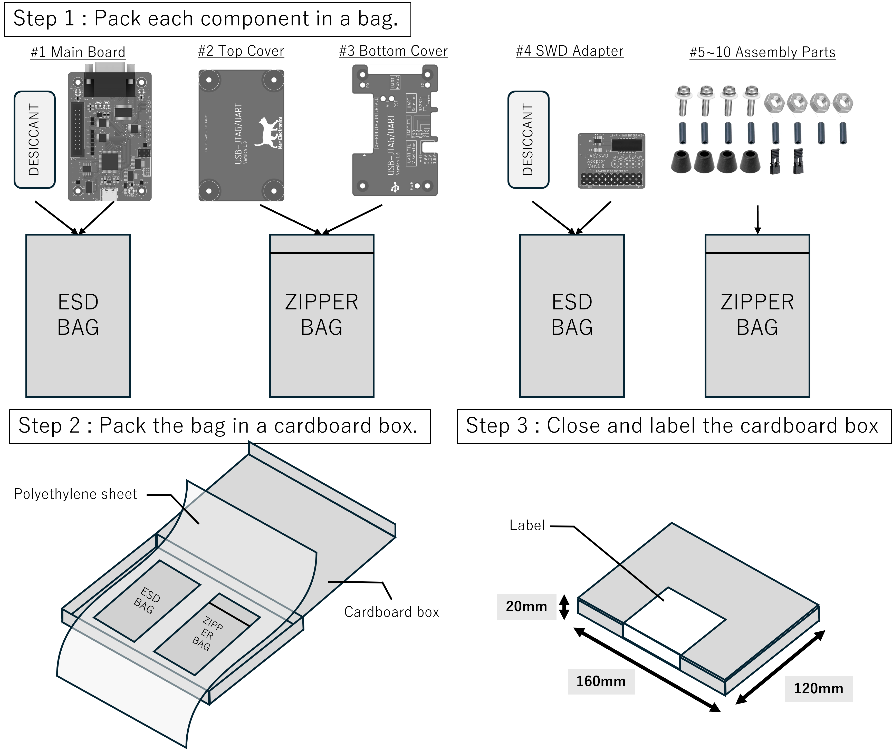
</div>

### ラベル情報
<div align="center">
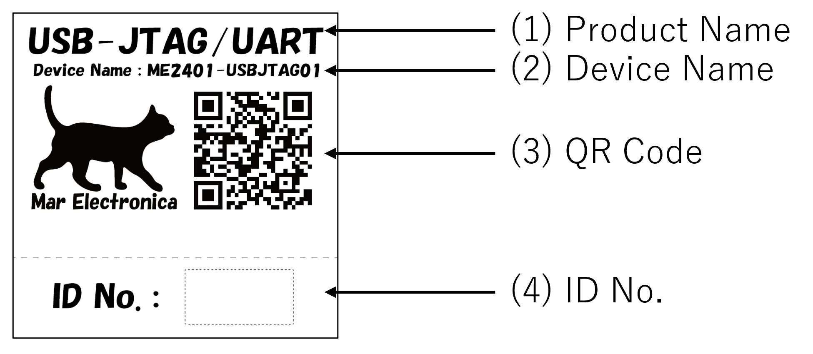
</div>

<div align="center">

| 表示内容         | 表示例           | 備考               |
|------------------|------------------|--------------------|
| (1) Product Name | USB-JTAG/UART    | 固定               |
| (2) Device Name  | ME2401-USBJTAG01 | 固定               |
| (3) QR Code      | ->               | 固定、GitHub URL   |
| (4) ID No.       | NNNN             | 可変、管理用ID番号 |

</div>

ID No.はメイン基板の裏面にもステッカーが貼られています。

<div align="center">
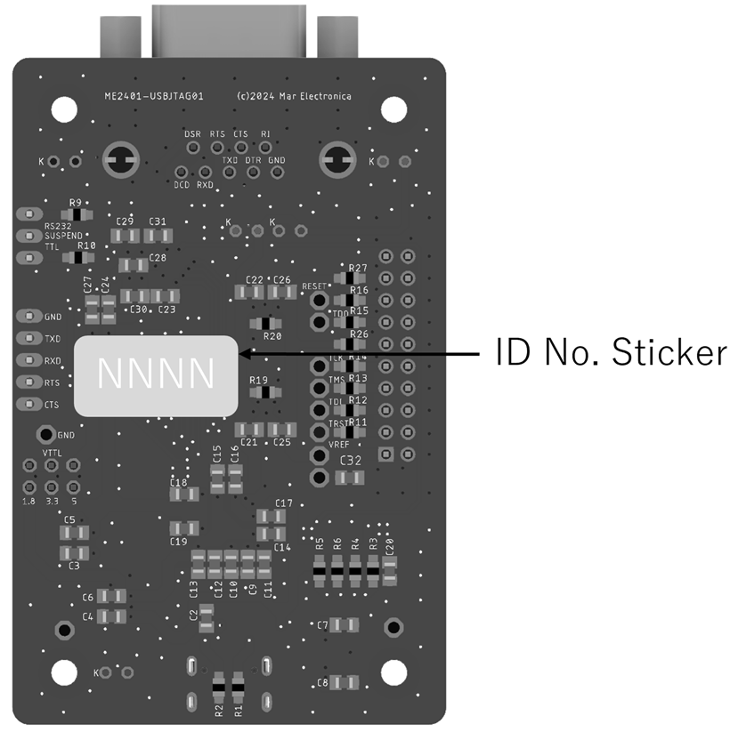
</div>


## 組立方法
下記の順番で重ねて、「#7 ワッシャ付きネジ(M3*30mm)」と「#8 ナット(M3)」で固定します。
- #2 上面カバー
- #6 樹脂スペーサー(M3*10mm)
- #1 メイン基板
- #5 樹脂スペーサー(M3*5mm)
- #3 底面カバー
- #9 ゴム足

<div align="center">
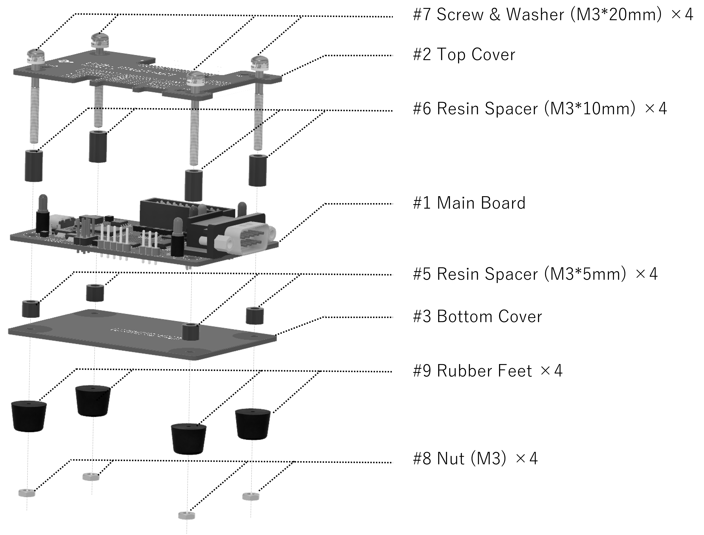
</div>

# 使用方法
## パソコンとの接続
パソコンとUSB Type-Cケーブルで接続してください。

<div align="center">
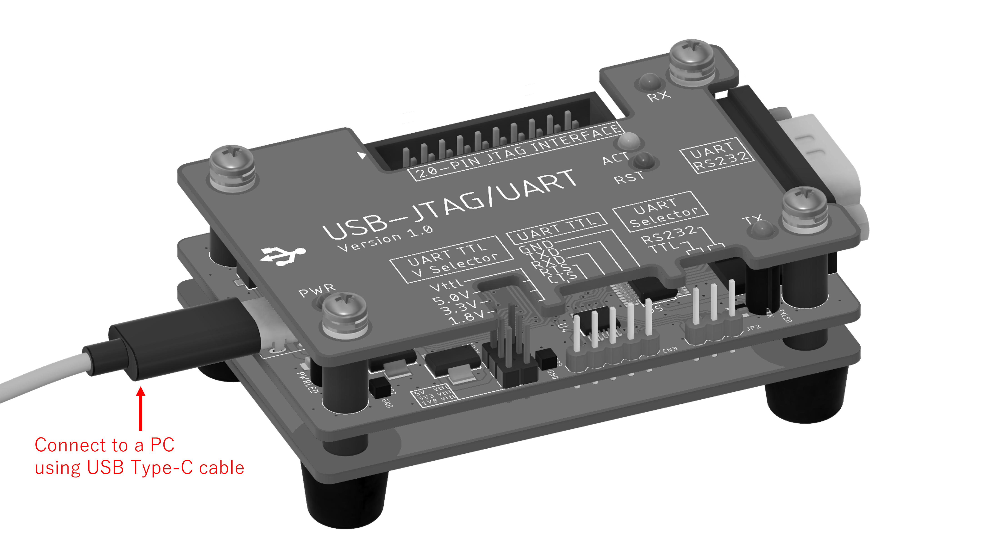
</div>

## デバイスドライバのインストールと設定
### インストール
#### Windows
Windows10以上のパソコンでは、デバイスドライバはインストール済か、自動でインストールされます。

自動で認識しない場合は、FTDI社のホームページからデバイスドライバをダウンロードしてインストールしてください。

[Drivers - FTDI](https://ftdichip.com/drivers/)

#### Linux
Ubuntu 11.10, kernel 3.0.0-19以降のパソコンでは、デバイスドライバはインストール済です。

### 設定
#### Windows
Windowsのパソコンを使用する場合、デバイスドライバを以下の手順で入れ替える。

1. デバイスドライバ入れ替えツールのZadigをダウンロード
    - [Zadig - USB driver installation made easy](https://zadig.akeo.ie/)
	- [An usage guide for Zadig is available HERE.](https://github.com/pbatard/libwdi/wiki/Zadig)
2. パソコンにME2401-USBJTAG01を接続した状態でダウンロードしたZadig(zadig-*.*.exe)を実行
3. ユーザーアカウント制御プロンプトが表示されたら"はい"を選択
<BR>
4. メニューバーの"Options"から"List All Devices"を選択
<BR>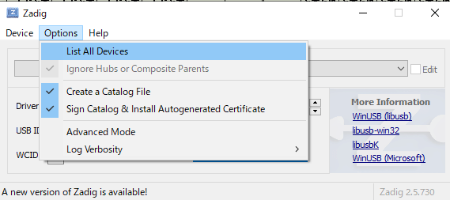
5. ドロップダウンリストから"ME2401-USBJTAG01(Interface 0)"を選択
<BR>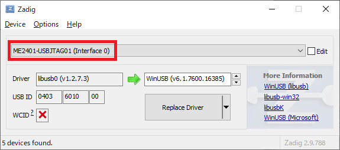
6. "WinUSB"を選択
<BR>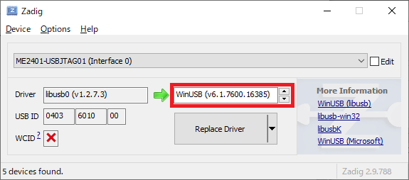
7. "Replace Driver"をクリックしてデバイスドライバを入れ替え
<BR>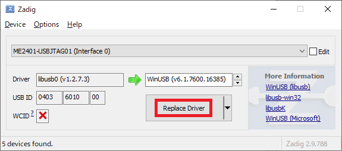

<span style="color: red; ">※※※ "ME2401-USBJTAG01(Interface 0)"のみデバイスドライバを入れ替えてください。 ※※※</span><BR>
<span style="color: red; ">※※※ "ME2401-USBJTAG01(Interface 1)"はデバイスドライバを入れ替えないでください。 ※※※</span>

#### Linux
Linuxのパソコンを使用する場合、ME2401-USBJTAG01を一般ユーザで使用できるようにするために、以下の手順で設定します。

1. /etc/udev/rules.d/99-me2401-usbjtag01.rulesというファイルを作成して以下を記載
```shell
# ME2401-USBJTAG01
ATTRS{idVendor}=="0403", ATTRS{idProduct}=="6010", MODE="0666"
```
2. 以下のコマンドを実行して設定を反映
```shell
sudo udevadm trigger
```

ME2401-USBJTAG01をLinuxのパソコンに接続すると、
/dev/ttyUSB0(数字は環境に依存)のようなデバイスファイルが作成されます。
上記の設定を行うことで、デバイスファイルが一般ユーザでもアクセス可能になります。

以下のコマンドでME2401-USBJTAG01がどのデバイスファイルに割り当てられたかを確認することが可能です。
```shell
sudo dmesg | grep -i usb
```

<div align="center">
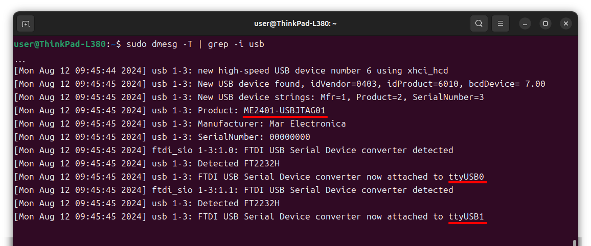
</div>

## OpenOCDによるデバッグ
### システム構成

### OpenOCDの入手
OpenOCD
[Open On-Chip Debugger](https://openocd.org/)

#### Windows
Windowsのパソコンを使用する場合、以下のホームページからビルド済みのバイナリ(xpack-openocd-x.xx.x-x-darwin-x64.tar.gz)が入手可能です。

[Releases xpack-dev-tools/openocd-xpack](https://github.com/xpack-dev-tools/openocd-xpack/releases)

#### Linux
Debian GNU/Linux系のLinuxのパソコンを使用する場合、以下のコマンドでインストールが可能です。
```shell
apt-get install openocd
```

### GDBの入手
デバッグするターゲットに応じたGDBを用意してください。

[GDB: The GNU Project Debugger](https://www.sourceware.org/gdb/)

### JTAGを使用したデバッグ
1. ターゲットとの接続
    - CN2とターゲットをケーブルで接続してください。
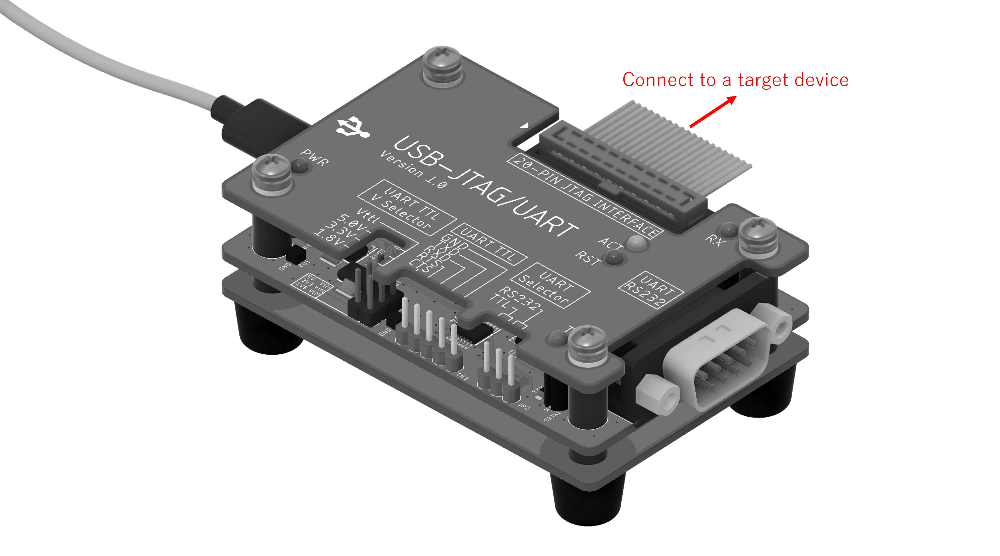

<span style="color: red; ">※※※ ターゲットとの接続は必ず電源を切った状態で行ってください ※※※</span>

2. OpenOCDの起動
    - -fオプションで[me2401-usbjtag01-jtag.cfg](./OpenOCD/me2401-usbjtag01-jtag.cfg)とターゲットに応じた設定ファイルを指定してください。
    - 正しく起動すると`Listening on port 333 for gdb connections`というメッセージが出力されます。
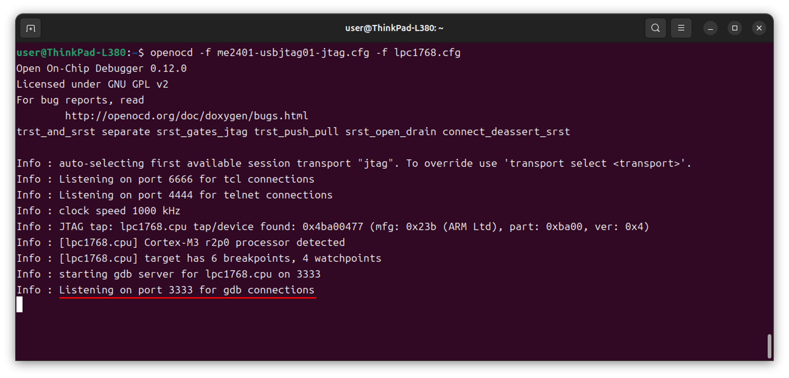

3. GDBの起動
    - ターゲットに応じたgdbを起動して`target extended-remote :3333`コマンドでOpenOCDに接続
    - GDBとの接続に成功するとOpenOCDに`accepting 'gdb' connection on tcp/3333`というメッセージが出力されます。
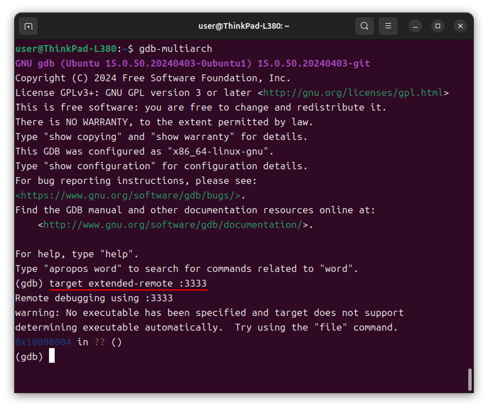
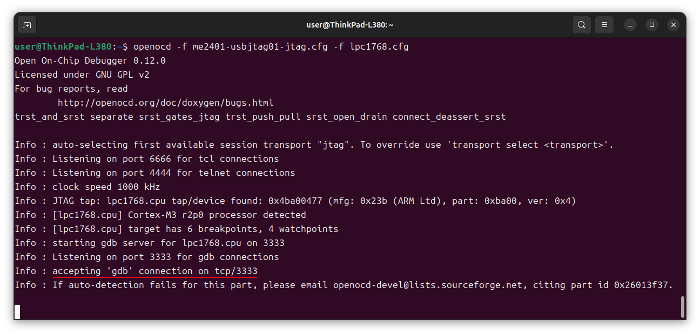

- 動作確認環境
    - OpenOCD 0.12.0
    - GNU gdb 15.0.50
    - Target Device : Blueboard LPC1768-H
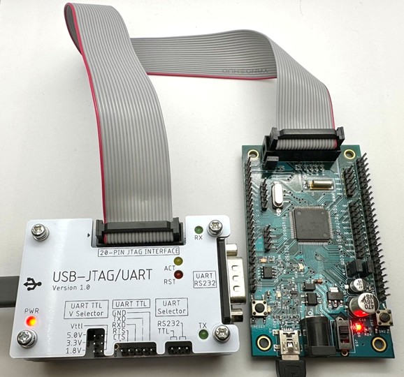 

### SWDを使用したデバッグ
1. ターゲットとの接続
    - SWDアダプタをCN2に取り付けてください。
    - SWDアダプタとターゲットをケーブルで接続してください。
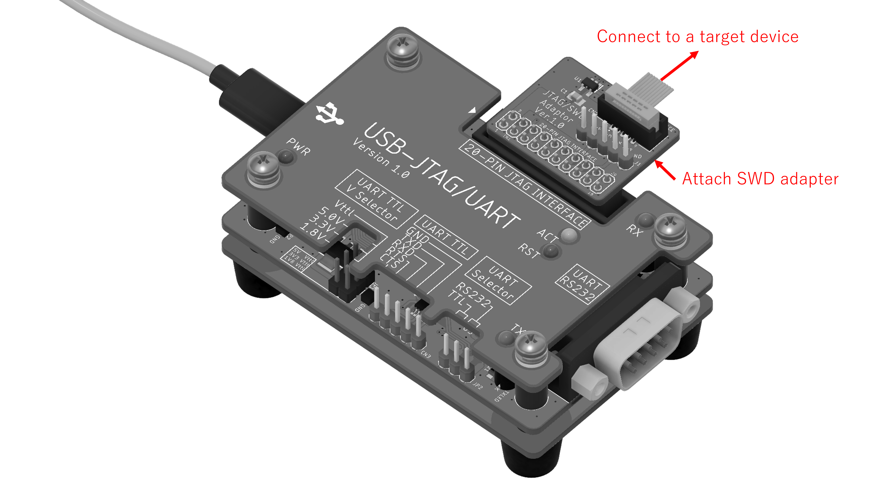

<span style="color: red; ">※※※ SWDアダプタの接続は必ず電源を切った状態で行ってください ※※※</span><BR>
<span style="color: red; ">※※※ ターゲットとの接続は必ず電源を切った状態で行ってください ※※※</span>

2. OpenOCDの起動
    - -fオプションで[me2401-usbjtag01-swd.cfg](./OpenOCD/me2401-usbjtag01-swd.cfg)とターゲットに応じた設定ファイルを指定してください。
    - 正しく起動すると`Listening on port 333 for gdb connections`というメッセージが出力されます。
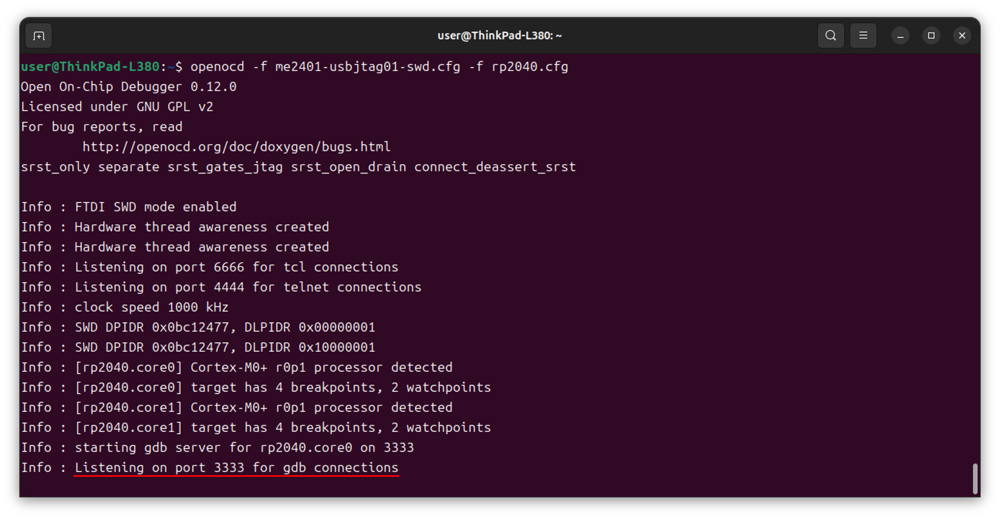

3. GDBの起動
    - ターゲットに応じたgdbを起動して`target extended-remote :3333`コマンドでOpenOCDに接続
    - GDBとの接続に成功するとOpenOCDに`accepting 'gdb' connection on tcp/3333`というメッセージが出力されます。
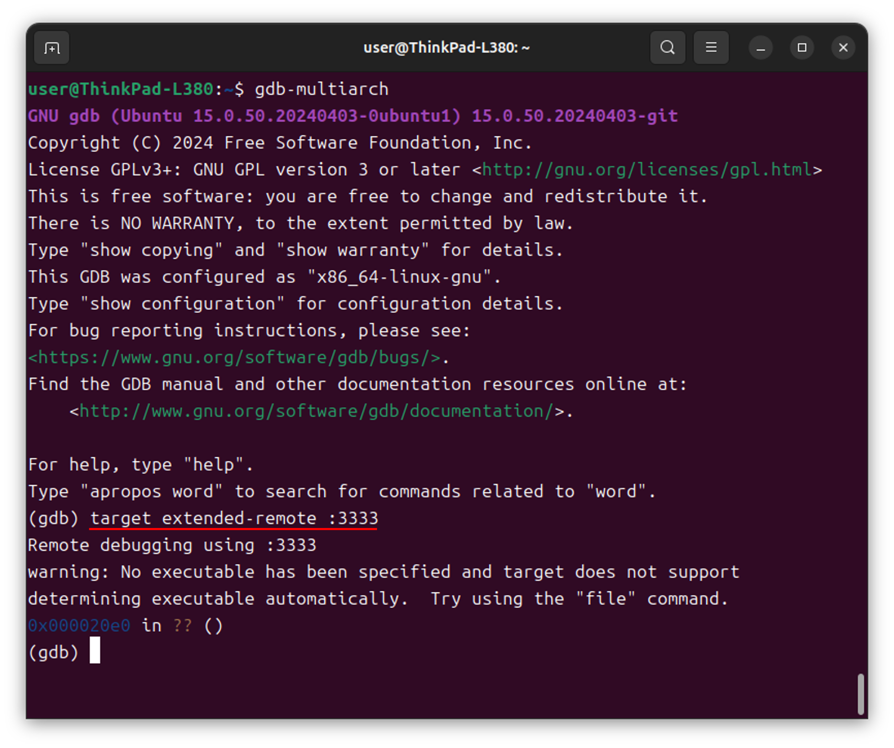
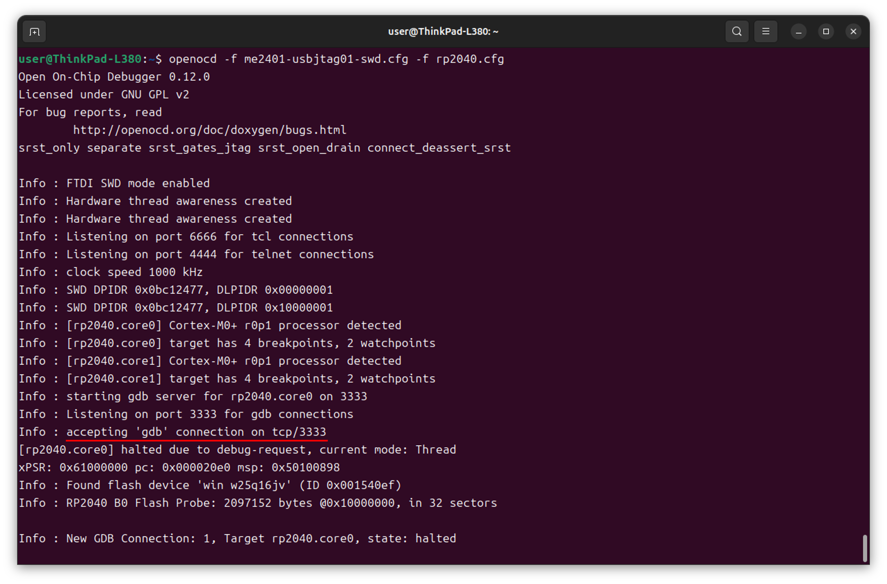

- 動作確認環境
    - OpenOCD 0.12.0
    - GNU gdb 15.0.50
    - Target Device : Raspberry Pi Pico
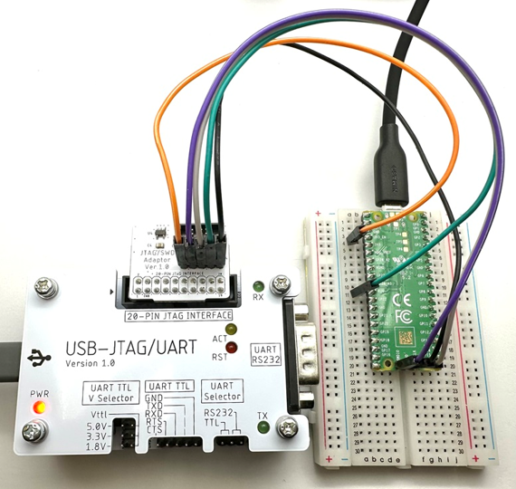

### LED
- JTAG/SWDのアクセスに応じてLED(ACT/黄)が点灯します。
- nSRSTアサート時にLED(RST/赤)が点灯します。

<div align="center">
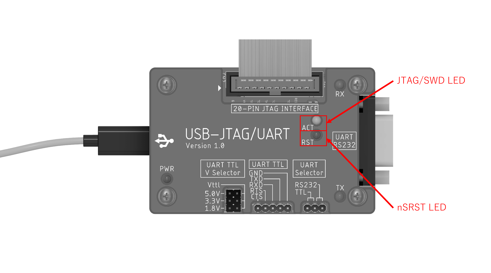
</div>

## UART
### ロジックレベルの選択
- TTL(1.1-5.5V)とRS-232を排他利用可能
- ボード上のピンヘッダ(JP2)で選択

<div align="center">
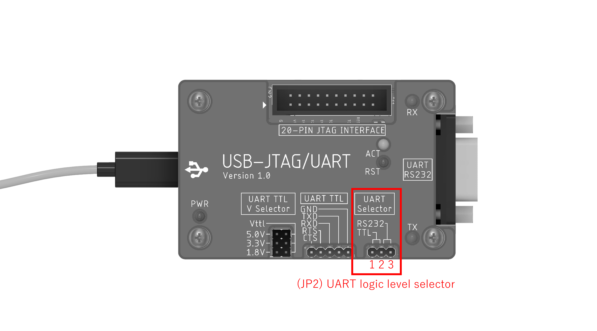
<span style="color: red; ">※※※ ピンヘッダの切り替えは必ず電源を切った状態で行ってください ※※※</span>
</div>

- TTLとして使用する場合
    - JP2のピン1と2をジャンパーソケットで短絡してください
<div align="center">
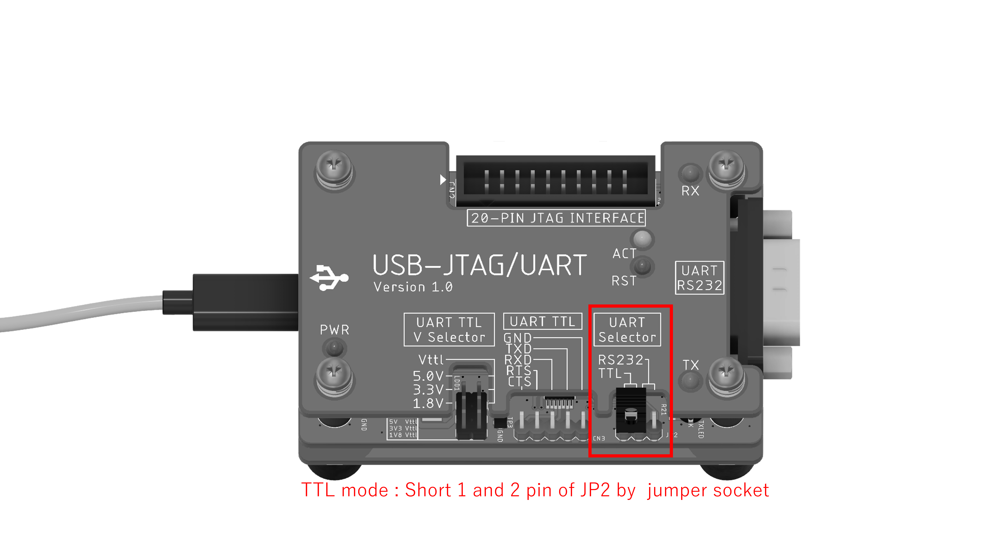
</div>

- RS-232として使用する場合
    - JP2のピン2と3をジャンパーソケットで短絡してください
<div align="center">
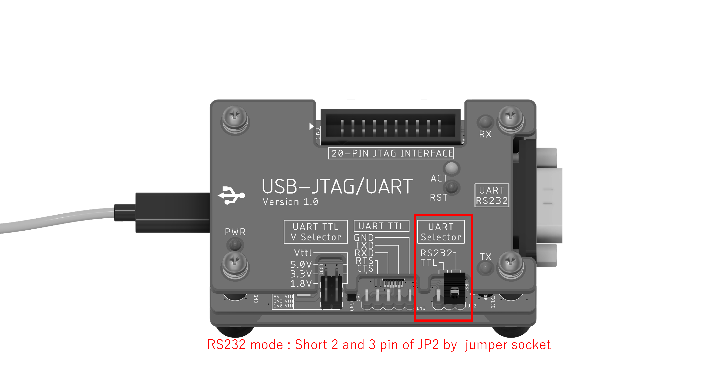
</div>

### TTL
#### コネクタ
- CN3のピンヘッダに接続して使用します。
<div align="center">
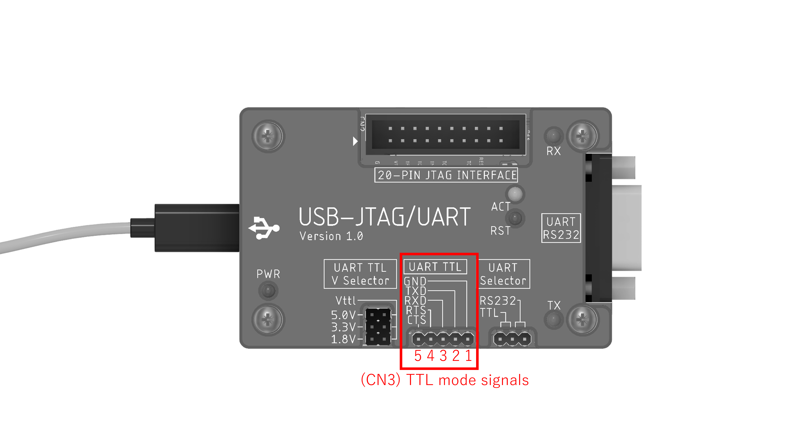
</div>

<div align="center">


| ピン番号 | 割り当て | 備考         |
|----------|----------|--------------|
| 1        | GND      |              |
| 2        | TXD      | FT2232HL出力 |
| 3        | RXD      | FT2232HL入力 |
| 4        | RTS      | FT2232HL出力 |
| 5        | CTS      | FT2232HL入力 |

</div>

#### TTL使用時の電圧
- TTL使用時の電圧は1.1-5.5Vの範囲
- ボード上のピンヘッダ(JP1)で選択
- 1.8V/3.3V/5Vの電圧をボード上で供給可能
- 1.1-5.5Vの範囲で電圧を外部から供給可能

<div align="center">
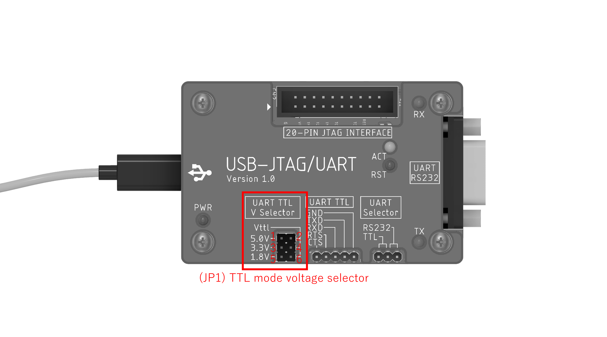
<span style="color: red; ">※※※ ピンヘッダの切り替えは必ず電源を切った状態で行ってください ※※※</span>
</div>

- 1.8Vで使用する場合
    - JP1のピン5と6をジャンパーソケットで短絡してください
<div align="center">

</div>

- 3.3Vで使用する場合
    - JP1のピン3と4をジャンパーソケットで短絡してください
<div align="center">
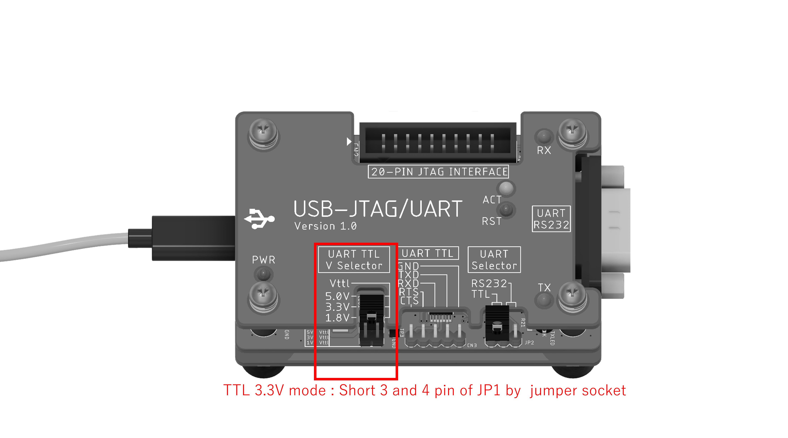
</div>

- 5Vで使用する場合
    - JP1のピン1と2をジャンパーソケットで短絡してください
<div align="center">

</div>

- 外部から電圧を供給する場合
    - JP1のピン2,4,6のいずれかに電圧を供給してください。
<div align="center">
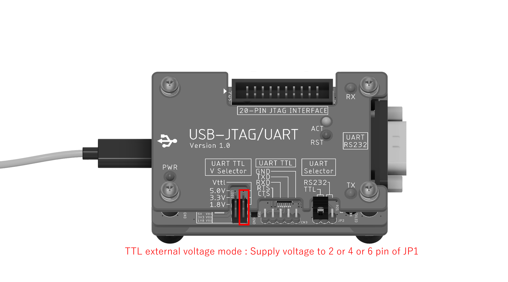
<span style="color: red; ">※※※ 1.1-5.5Vの範囲でご使用下さい。 ※※※</span>
</div>

### RS-232
#### コネクタ
- CN4のD-Sub 9pinコネクタとターゲットをケーブルで接続します

<div align="center">
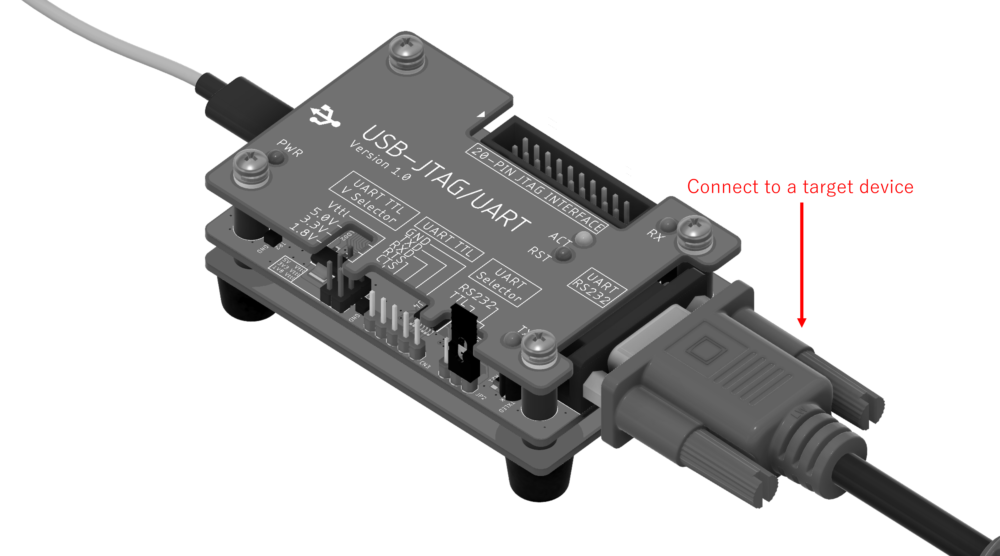
</div>

### LED
UARTの送受信に応じてLEDが点灯します。
- 送信：TXLED(緑)
- 受信：RXLED(緑)

<div align="center">
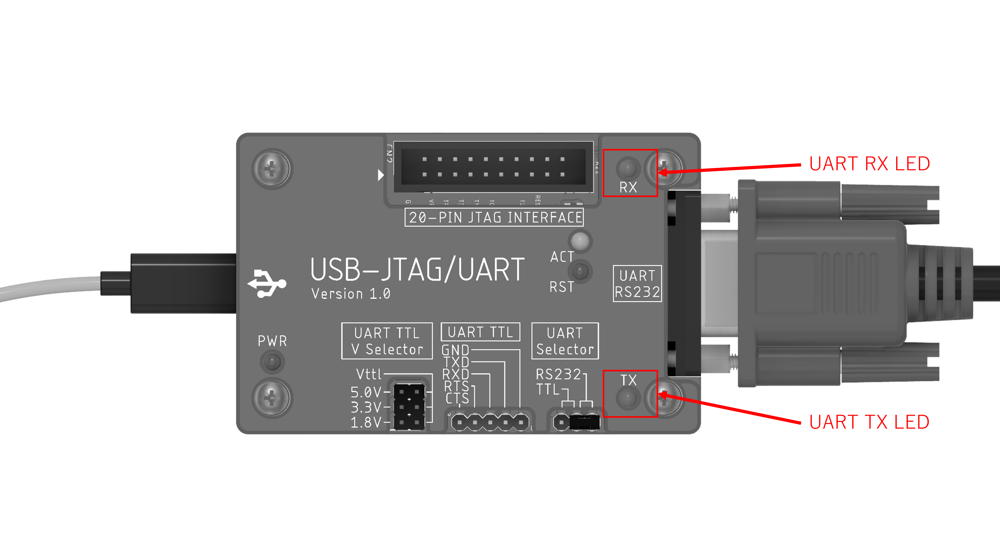
</div>

# サポート
- 質問や不具合報告はGitHubの[Issues](https://github.com/mar-electronica/ME2401-USBJTAG/issues)、またはinfo@mar-electronica.jp宛にお願いします。
