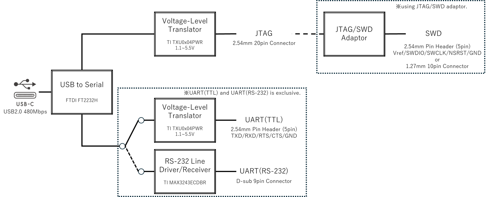
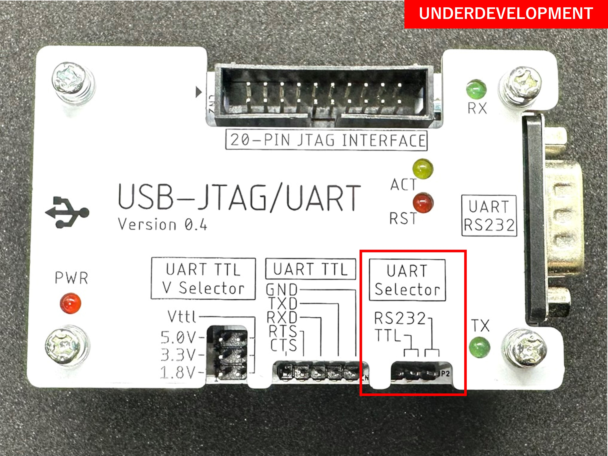
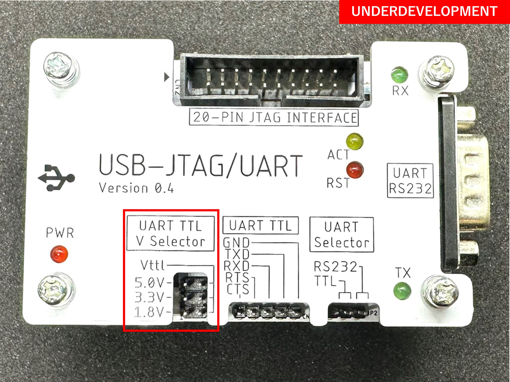

# ME2401-USBJTAG
USB-JTAG/UART

FT2232H搭載USBシリアル変換モジュール

<!--  -->

[English README is here.](https://github.com/mar-electronica/ME2401-USBJTAG/blob/main/README-en.md)

# 概要
<!--  -->

- FTDI製FT2232H搭載USBシリアル変換モジュール
- JTAGとUARTが各1ch同時に使用可能
- JTAGのVref電圧は1.1-5.5Vをサポート
- JTAG-SWD変換モジュール付属
- [OpenOCD](https://openocd.org/)を使用してJTAGデバッガとして使用可能
- UARTのロジックレベルはTTL(1.1-5.5V)とRS-232をサポート

# 仕様
- USB
  - USB2.0 High Speed 480Mbps
  - バスパワー動作
  - Type-Cコネクタ
- JTAG
  - 2.54mm 20pinコネクタ
    - 20-pin ARM Standard JTAG互換
  - Vref電圧
    - 1.1V-5.5Vの範囲でリファレンス電圧を外部から供給可能
- SWD
  - SWD変換モジュールを使用してSWDでの接続が可能
  - 3ステートバッファによるSWDIOの双方向制御
  - 1.27mm 10pinコネクタ
    - Cortex Debug (10-pin)互換
  - 2.54mmピンヘッダ
    - SWDIO/SWCLK/nSRSTをサポート
  - Vref電圧
    - 1.1V-5.5Vの範囲でリファレンス電圧を外部から供給可能
- UART
  - ロジックレベルはTTL(1.1-5.5V)とRS-232を排他利用可能
    - ボード上のピンヘッダで選択
  - TTL
    - 2.54mmピンヘッダ
      - TXD/RXD/RTS/CTSをサポート
    - 電圧
      - 1.8V/3.3V/5Vの電圧をボード上で供給可能
      - 1.1-5.5Vの範囲で電圧を外部から供給可能
  - RS-232
    - RS-232のラインドライバ・レシーバ搭載
- 寸法
  - W81mm x D50mm x H35mm

# 製品構成
## 同梱品
| #  | 名称                            | 個数 |
|----|---------------------------------|------|
| 1  | メイン基板                      | 1    |
| 2  | 上面カバー                      | 1    |
| 3  | 底面カバー                      | 1    |
| 4  | JTAG/SWD変換基板                | 1    |
| 5  | ナイロンスペーサー M3*5mm       | 4    |
| 6  | ナイロンスペーサー M3*10mm      | 4    |
| 7  | ワッシャ付きネジ M3*30mm        | 4    |
| 8  | ナット M3                       | 4    |
| 9  | ゴム足                          | 4    |
| 10 | ジャンパソケット                | 3    |
| ~11~ | ~USB Type-A to Type-Cケーブル 1m~ | ~1~    |
| ~12~ | ~JTAG 20Pin リボンケーブル 30cm~  | ~1~    |

## パッケージ
- W160mm x D120mm x H20mm

<!--  -->

## 組立方法

TBD

# 使用方法
## PCとの接続
PCとUSB Type-A to Type-Cケーブルで接続してください。

<!--  -->

## デバイスドライバのインストールと設定
### インストール
#### Windows
Windows10以上のパソコンでは、デバイスドライバはインストール済か、自動でインストールされます。

自動で認識しない場合は、FTDI社のHPよりドライバをダウンロードしてインストールしてください。

[Drivers - FTDI](https://ftdichip.com/drivers/)

#### Linux
Ubuntu 11.10, kernel 3.0.0-19以降のパソコンでは、デバイスドライバはインストール済です。

### 設定
#### Windows
TBD
[Zadig - USB driver installation made easy](https://zadig.akeo.ie/)

#### Linux
TBD

## JTAG
### OpenOCD
TBD

### GDBからの接続
TBD

### LED
JTAGのアクセスに応じてLEDが点灯します。
- ALED(黄)

nSRSTアサート時にLEDが点灯します。
- RLED(赤)

## SWD
### SWD変換モジュールの接続
TBD

### OpenOCD
TBD

### GDBからの接続
TBD

## UART
### ロジックレベルの選択
- TTL(1.1-5.5V)とRS-232を排他利用可能
- ボード上のピンヘッダ(JP2)で選択

<!--  -->

- TTLとして使用する場合(TBD)

- RS-232として使用する場合(TBD)

### TTL
#### コネクタ
- CN3のピンヘッダに接続して使用します。

#### TTL使用時の電圧
- TTL使用時の電圧は1.1-5.5Vの範囲
- ボード上のピンヘッダ(JP1)で選択
- 1.8V/3.3V/5Vの電圧をボード上で供給可能
- 1.1-5.5Vの範囲で電圧を外部から供給可能

<!--  -->

##### 1.8Vで使用する場合(TBD)

##### 3.3Vで使用する場合(TBD)

##### 5Vで使用する場合(TBD)

##### 外部から電圧を供給する場合

※1.1-5.5Vの範囲でご使用下さい。

### RS-232
#### コネクタ
- CN4のD-Sub 9Pinコネクタに接続して使用します。

<!--  -->

### LED
UARTの送受信に応じてLEDが点灯します。
- 送信：TXLED(緑)
- 受信：RXLED(緑)

<!--  -->

# サポート
- 質問や不具合報告はGitHubのIssuesでお願いします。
